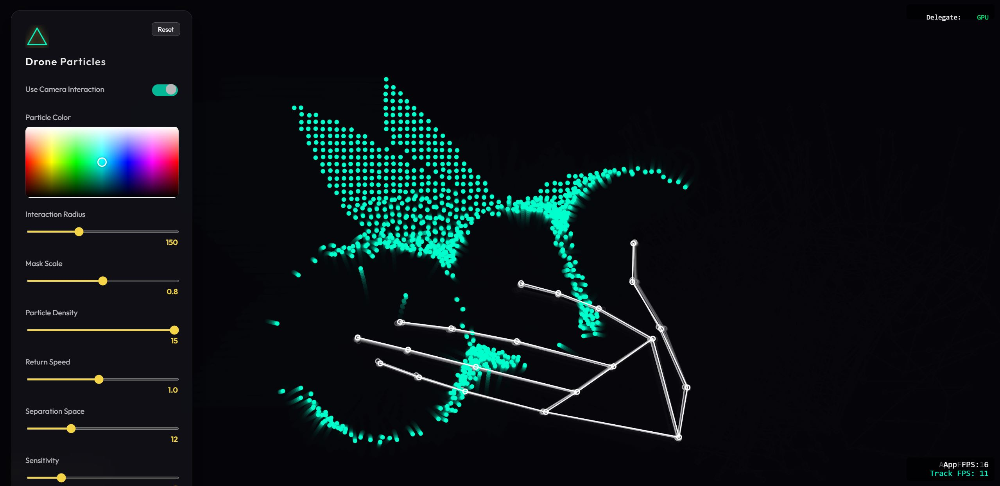

# DroneParticles

```javascript
/**
 * Project: DroneParticles
 * 
 * Generated with assistance of: Gemini Flash 3
 * Date: January 2026
 * 
 * Human Authorship & Refinement: Carles Gutiérrez
 * - Interactive UI implementation and 2D Color Slider
 * - MediaPipe Hand Tracking integration
 * - Performance optimization via Spatial Partitioning (Grid System)
 * - Chain reaction repulsion logic
 */
```

## Description


**DroneParticles** is a high-performance interactive particle system built with **p5.js** and **MediaPipe**. It transforms any image into a dynamic constellation of "drones" that react to the user's presence. Whether through the mouse or real-time hand tracking via webcam, the particles exhibit lifelike behaviors, floating, following, and repelling each other in a fluid, organic dance.

## Key Features
- **Real-time Hand Tracking**: Use your hands to interact with the particles thanks to MediaPipe's Hand Landmarker.
- **Image Masking**: Drag and drop any image to change the formation of the particles.
- **Interactive UI**: Fine-tune behaviors like density, return force, separation, and sensitivity in real-time.
- **2D Color Gradient**: Custom color picker to change the particle's aesthetic on the fly.

---

## Technical & Didactic Breakdown (Algorithms)

To make this project educational, here are the core algorithms used to achieve the fluid motion and performance:

### 1. Steering Behaviors (Reynolds)
The particles follow the core principles of autonomous agents described by Craig Reynolds:
- **Arrive**: Particles calculate a steering force to reach their target (a point in the image). As they get closer, they slow down smoothly to avoid jittering.
- **Flee**: When a particle detects an "enemy" (mouse or hand), it calculates a force in the opposite direction, weighted by distance.

### 2. Perlin Noise (Natural Hovering)
Unlike random movement, which is jerky, we use **Perlin Noise (`noise()`)** to give each particle a unique "offset". This generates a smooth, organic floating motion that mimics the hovering of a drone or the movement of a bioluminescent creature.

### 3. Spatial Partitioning (Grid System Optimization)
Checking $N$ particles against $N$ other particles for repulsion is an $O(N^2)$ operation, which is very slow. 
- **The Solution**: We divide the screen into a **Grid**. Each particle only checks for neighbors in its current and adjacent cells. This brings the complexity down significantly, allowing for thousands of particles at 60 FPS.
- **Advanced Optimization (TypedArrays)**: To reduce pressure on the Garbage Collector (crucial for browsers like Firefox), we replaced dynamic objects and strings with a fixed **TypedArray Bucket System** (`Int32Array`). This allows for zero-allocation spatial partitioning every frame.

### 4. Browser Performance Observations
During development, significant performance differences were observed:
- **Chrome (V8 Engine)**: Highest performance. Excellent optimization of the MediaPipe WASM bundle and SIMD operations.
- **Firefox (SpiderMonkey)**: Slightly more sensitive to memory allocation. The implementation of the pre-allocated bucket system was essential to maintain 60 FPS in this browser by avoiding GC (Garbage Collection) spikes.
Particles don't just repel each other statically. We implemented a **movement-based threshold**:
- A particle only repels its neighbors if it is currently moving (e.g., being pushed by the hand).
- This creates a "ripple effect" or chain reaction that propagates through the structure, making it feel more interactive and alive.

### 5. Interaction Radius & Physics
Each particle is an object with position, velocity, and acceleration vectors. The **Interaction Radius** defines a circular "influence zone". When a hand point or mouse enters this zone, a force is applied to the particle that is inversely proportional to its distance, creating a natural-looking push-away effect.

### 6. MediaPipe Integration (v0.10.32)
We use the **MediaPipe Tasks Vision** library (version `0.10.32`) to track hand movements.

**Optimization Strategy:**
- **Asynchronous Execution**: The tracking loop is decoupled from the p5.js render loop using `requestAnimationFrame`. This ensures that even if the AI detection takes a few milliseconds, the particle animation stays smooth at 60 FPS.
- **GPU Delegate**: The system is explicitly configured to use `delegate: "GPU"`, offloading the heavy neural network processing to the user's graphics card via WebGL.
- **Selective Tracking**: Instead of using all 21 hand landmarks for physics, we filter only the most relevant points (tips and wrist) to reduce unnecessary force calculations.

---

## Project Structure
```text
.
├── index.html      # Markup and UI structure
├── style.css       # Neumorphic/Glassmorphism UI styling
├── sketch.js       # Main logic: Setup, Draw loop, Hand Tracking
├── particle.js     # Particle class: Physics, Behaviors, Grid logic
├── mask.png        # Default initial target image
├── LICENSE         # MIT License
└── README.md       # Project documentation
```

---

## Future Improvements & Roadmap

- **Kinetic Mask**: Make the target image move autonomously across the screen (using noise or paths), forcing the "drone swarm" to travel as a unit.
- **Fish Tank Mode**: Implement multiple independent masks (images) that move like fish in a tank.
- **Smart Reassignment**: Develop an algorithm to reassign particles to the nearest "moving mask" dynamically to maintain visual coherence when multiple shapes are on screen.
- **Performance Push**: 
    - Offload the Grid calculations to a **Web Worker**.
    - Explore **p5.js WebGL mode** or a custom **GPGPU** (General Purpose GPU) implementation using compute shaders to handle hundreds of thousands of particles.
- **Desktop Adaptation (Electron)**: Convert the project into a desktop application using **Electron**. This would allow for better resource management, access to localized hardware acceleration, and potentially higher performance by using a dedicated Chromium environment.

---

## License
This project is licensed under the **MIT License**. See the `LICENSE` file for details.
